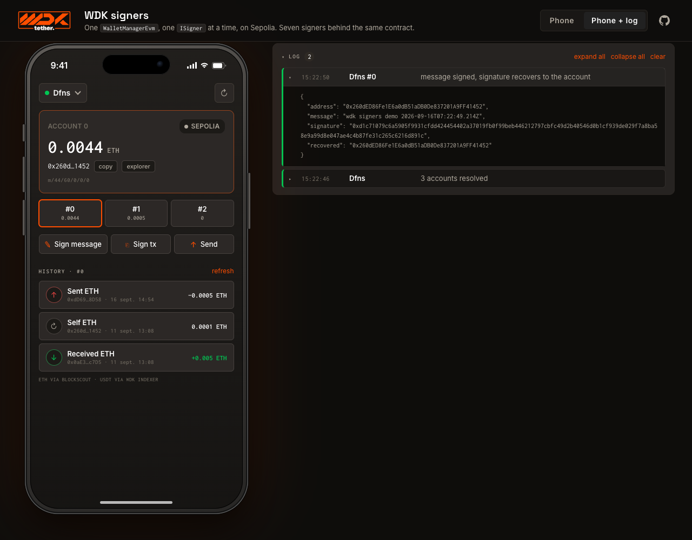

# wdk-signers-demo

One wallet, seven ways to hold the key. A Vite app on the [Tether WDK](https://github.com/tetherto/wdk-wallet-evm)
where a single `WalletManagerEvm` runs on one `ISigner` at a time: a seed phrase, a Ledger, MetaMask,
Turnkey, Dfns, Openfort or Fireblocks. Pick a signer, the phone shows its accounts, balances and
history on Arbitrum One (or Sepolia behind the testnet toggle); sign a message, sign a transaction offline, or send ETH to another account the
demo controls. A developer panel keeps every call with the bytes behind it.



## Signers

| Signer | Key custody | Runs in | Package | Live check |
|---|---|---|---|---|
| Seed phrase | `VITE_DEMO_SEED_PHRASE` in `.env`, else a throwaway per browser origin | browser | `@tetherto/wdk-wallet-evm/signers` | yes |
| Ledger | the device, WebHID | browser | [wdk-signer-ledger-evm](https://github.com/G9NCUE/wdk-signer-ledger-evm) | offline tests, device pending |
| MetaMask | the extension, EIP-1193 | browser | [wdk-signer-eip1193-evm](https://github.com/G9NCUE/wdk-signer-eip1193-evm) | connected, see limits |
| Turnkey | Turnkey HD wallet, policies | service | [wdk-signer-turnkey-evm](https://github.com/G9NCUE/wdk-signer-turnkey-evm) | yes on Sepolia (2026-09-10); free-plan signing quota exhausted since |
| Dfns | Dfns MPC, one wallet per network on a derived key | service | [wdk-signer-dfns-evm](https://github.com/G9NCUE/wdk-signer-dfns-evm) | yes, both networks, gasless USDT0 on Arbitrum |
| Openfort | Openfort TEE backend wallet | service | [wdk-signer-openfort-evm](https://github.com/G9NCUE/wdk-signer-openfort-evm) | yes, both networks, gasless USDT0 on Arbitrum |
| Fireblocks | Fireblocks MPC vault account | service | [wdk-signer-fireblocks-evm](https://github.com/G9NCUE/wdk-signer-fireblocks-evm) | yes, sandbox, Sepolia only |

## Networks

The demo runs on **Arbitrum One** by default. A discreet **Testnet** toggle in the top bar switches
to **Sepolia** and back; the choice is remembered per browser. The network pill on the balance card
shows the current network and lists the networks of the current mode. On a switch the signer stays,
the wallet is rebuilt on the other chain, balances and history follow. On Arbitrum the card also shows the **USDT0** balance, the send sheet offers ETH or
USDT0, and a USDT0 send defaults to **gasless**: the WDK's `wdk-wallet-evm-7702-gasless` module wraps
the account, delegates it with an EIP-7702 authorization and sends a user operation through Candide's
public bundler, gas paid in USDT0 by the paymaster. That works with every signer that signs an
authorization, so all of them except MetaMask. Dfns gets one wallet per network on the same derived
key (same address on both chains); Fireblocks stays on Sepolia because its sandbox refuses mainnet
assets, and is greyed out on Arbitrum. `src/lib/networks.js` holds the network table,
`src/lib/support.js` says which signer runs where.

Derivable signers (seed, Ledger, Turnkey, Dfns) show accounts 0 to 2 at `m/44'/60'/0'/0/i`.
Single-key signers (MetaMask, Openfort, Fireblocks) are registered by name with `wallet.addSigner()`
and show one account. Every package implements the `ISignerEvm` contract of `wdk-wallet-evm`
1.0.0-beta.18 by shape, with offline tests through the real `WalletManagerEvm`, and none is on npm.

**MetaMask is kept as the illustration of a boundary.** An injected wallet signs messages and typed
data but never returns a signed transaction: it only knows `eth_sendTransaction`, where it signs and
broadcasts itself. So "Sign tx" is greyed out for it and "Send" goes through the wallet's own path,
outside the WDK's sign-then-broadcast. Fee control, the failover provider and EIP-7702 do not apply.

## How it is built

```
browser  ─ WalletManagerEvm ─ ISigner ──┬─ SeedSignerEvm            (key in the page)
                                        ├─ LedgerSignerEvm          (WebHID, key on the device)
                                        ├─ Eip1193SignerEvm         (window.ethereum)
                                        └─ RemoteSignerEvm ── HTTP ──┐
                                                                     │
service  127.0.0.1:8787, Hono, keys in .env ─────────────────────────┴─ Turnkey / Dfns / Openfort / Fireblocks
```

API keys never reach the browser. The service holds one root signer per provider and answers the
`ISigner` calls of a `RemoteSignerEvm` (`derive`, `address`, `sign`, `signTransaction`,
`signTypedData`, `signAuthorization`) with addresses and signatures only. It also serves the history,
merged from Blockscout (native ETH, no key) and the WDK indexer (USDT transfers, key optional), since
the WDK indexer has no native-coin history.

```
src/
  App.jsx                        the phone, the picker and send sheets, the developer log
  signers/catalog.js             the seven signers, browser ones built in place
  signers/remote-signer-evm.js   ISigner whose calls go to the service
  lib/wallet.js                  WalletManagerEvm per signer, accounts, balances, the three actions, the 7702 gasless route
  lib/networks.js                Sepolia and Arbitrum: RPC, explorer, history sources, tokens, gasless config
  lib/recipients.js              the other demo accounts, as send targets
server/
  registry.js                    one root signer per provider, built from .env
  app.js                         the routes; index.js is the listener
  history.js                     Blockscout and WDK indexer, merged
  probe.js                       every signer call from Node, through the real WalletManagerEvm
  setup-openfort.mjs             one-time: creates the Openfort backend wallet, prints the .env line
  setup-fireblocks.mjs           one-time: creates the vault account and its Sepolia asset, prints the .env line
tests/                           see Tests
```

## Run

```
git clone https://github.com/G9NCUE/wdk-signers-demo
# the signer packages are linked from sibling folders, clone them next to it:
for r in ledger turnkey dfns openfort fireblocks eip1193; do git clone https://github.com/G9NCUE/wdk-signer-$r-evm; done
cd wdk-signers-demo && npm install
cp .env.example .env      # fill the providers you have, the others show as unavailable
npm run dev               # web on http://localhost:5173, service on 127.0.0.1:8787
```

Requirements: Node 22 or later, Chrome or Edge for Ledger (WebHID) and MetaMask, some Sepolia ETH
from any faucet for the sends.

### Providers

| Provider | Variables | Where they come from |
|---|---|---|
| Turnkey | `TURNKEY_ORGANIZATION_ID`, `TURNKEY_API_PUBLIC_KEY`, `TURNKEY_API_PRIVATE_KEY`, `TURNKEY_WALLET_ID` | app.turnkey.com, an API key and an HD wallet |
| Dfns | `DFNS_AUTH_TOKEN`, `DFNS_CRED_ID`, `DFNS_PRIVATE_KEY_FILE`, `DFNS_MASTER_KEY_ID`, `DFNS_NETWORK` | app.dfns.io, a service account with a P-256 key and a master key |
| Openfort | `OPENFORT_SECRET_KEY`, `OPENFORT_WALLET_SECRET`, `OPENFORT_ACCOUNT_ID` | dashboard.openfort.io, then `npx @openfort/cli backend-wallet setup`, then `node --env-file=.env server/setup-openfort.mjs` |
| Fireblocks | `FIREBLOCKS_API_KEY`, `FIREBLOCKS_SECRET_KEY_FILE`, `FIREBLOCKS_VAULT_ACCOUNT_ID` | a sandbox workspace; an API user with the Signer role from Developer Center → API Users (let the console generate the key pair and download the private key, or upload a CSR); then `node --env-file=.env server/setup-fireblocks.mjs` for the vault account and its `ETH_TEST5` address |
| WDK indexer | `WDK_INDEXER_API_KEY` | wdk-api.tether.io/register, free, for the USDT half of the history |

`.env.example` lists everything, including the optional endpoints. `.env` is gitignored, keep it
mode 600.

## Tests

Three layers, nothing is ever broadcast:

```
npm test              # offline: bigint JSON, the HTTP signer protocol through the real WalletManagerEvm
                      # on the WDK's own signers, the history merge on stubbed replies, dispose ownership
npm run test:live     # every provider configured in .env, on every network it supports, service
                      # in-process: balances (ETH and USDT0), a transaction populated from the chain and
                      # signed, message, typed data, and on Arbitrum a gasless quote when the account holds
                      # USDT0; unconfigured providers skip, a provider quota skips with the reason;
                      # LIVE_NETWORKS=arbitrum narrows it
npm run test:browser  # the phone in Chrome (Playwright, `chrome` channel) with `npm run dev` up:
                      # picker, accounts, balances, history, sign message, sign tx, the send sheet
                      # cancelled, the switch to Arbitrum and back; DEMO_SIGNER=Openfort picks another signer
```

Ledger and MetaMask need a device or an extension in a headed browser and stay manual.
`node server/probe.js [id]` runs the four signatures of a remote signer from the terminal with timings.

## Findings on the WDK contract, from building this

- `account.signTransaction(tx)` hands the request to the signer as is; only `sendTransaction`
  populates nonce, fees and chain. Turnkey refuses an unpopulated transaction, the seed signer
  signs it with chain id 0. The demo populates before signing.
- `WalletManager.dispose()` disposes an account only when `keyPair.privateKey` is set. External
  signers report `null`, so their derived accounts outlive `dispose()`. The packages here share a
  lifecycle between a root and its children so the root's dispose ends them.
- `ISignerEvm` assumes a signer returns bytes and the WDK broadcasts. Injected wallets sign and
  broadcast in one step; the contract has no place for them today.
- beta.18 does not export `ISignerEvm`; the `fix/universal-signer` branch does, and reports paths
  with the `m/` prefix, which the packages here follow.
- The Ledger Ethereum kit 1.18 signs EIP-7702 authorizations (`signDelegationAuthorization`), which
  PR #89 of `wdk-wallet-evm` declared impossible in July.
- `wdk-wallet-evm-7702-gasless` signs the user operation as EIP-712 data whose message holds BigInt
  values; a signer that forwards typed data to an API must make it JSON-safe first (Dfns' SDK throws on
  a BigInt). The Dfns and Ledger packages now pass it through `TypedDataEncoder.getPayload`. Filed as
  [issue #42](https://github.com/tetherto/wdk-wallet-evm-7702-gasless/issues/42) with the question of who should normalise.
- `wdk-wallet-evm-erc-4337` reads the seed's private key, so only the seed signer can use it;
  `wdk-wallet-evm-7702-gasless` wraps any account and needs `signAuthorization` only, so every signer
  here but MetaMask can go gasless. It pins `wdk-wallet-evm` beta.17 and checks `instanceof`, hence
  the npm `overrides` in `package.json`.
- Candide's public Arbitrum bundler rejects EntryPoint v0.8 user operations at `eth_sendUserOperation`
  with a garbled `-32500` (the error text is the EntryPoint's bytecode), while estimation and the
  paymaster quote pass; the same operation on EntryPoint v0.9 goes through. The demo uses v0.9.

## Design

Same tokens, type and components as [wdk-atlas](https://github.com/G9NCUE/wdk-atlas): dark ground,
orange accent, Inter, Space Grotesk and Inconsolata self-hosted under `public/assets/fonts/` (SIL Open
Font License, see the LICENSE.md there), 10 px cards on 1 px lines, mono uppercase eyebrows.

## Status

A prototype for the WDK "Abstract signer" work. It runs on Arbitrum One by default with real USDT0,
so the demo seed (from `.env`, or generated per browser origin) is a hot key held by the page: keep small
amounts on it, and note that a `VITE_` variable is shipped to the browser bundle. It tests a contract,
it does not custody funds. Apache-2.0.
